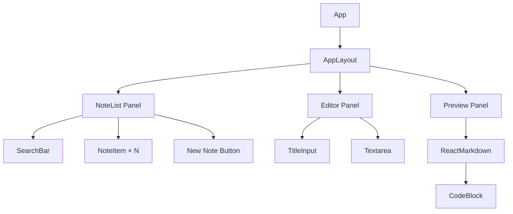
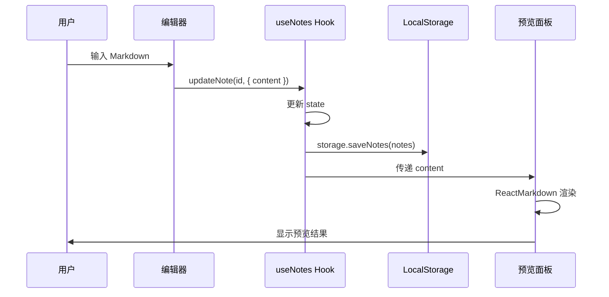
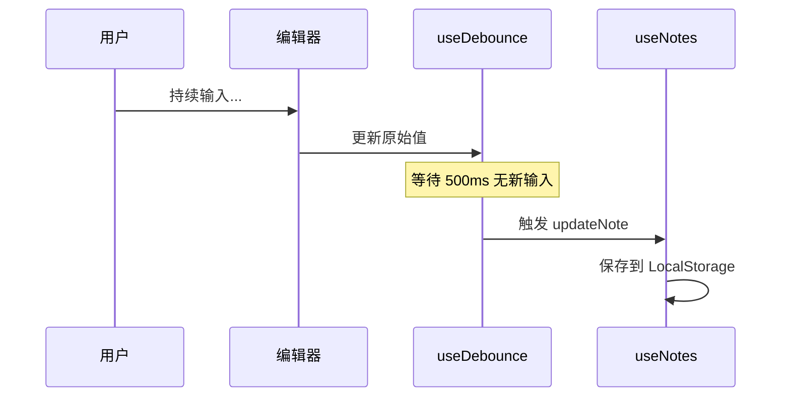

# 技术设计文档：Markdown 笔记应用

## 1. 技术选型

| 类别 | 技术 | 版本 | 说明 |
|------|------|------|------|
| **前端框架** | React | ^18.x | 组件化开发，高效渲染 |
| **语言** | TypeScript | ^5.x | 类型安全，提升开发体验 |
| **构建工具** | Vite | ^5.x | 极速冷启动，HMR 热更新 |
| **Markdown 解析** | react-markdown | ^9.x | React 生态 Markdown 渲染组件 |
| **代码高亮** | react-syntax-highlighter | ^15.x | 代码块语法高亮 |
| **CSS 框架** | Tailwind CSS | ^3.x | 原子化 CSS，快速样式开发 |
| **数据存储** | LocalStorage | - | 浏览器原生 API，无需后端 |
| **唯一 ID** | crypto.randomUUID() | - | 浏览器原生 UUID 生成 |

---

## 2. 项目结构

```
project/
├── public/
│   └── favicon.svg
├── src/
│   ├── components/           # UI 组件
│   │   ├── NoteList/         # 笔记列表面板
│   │   │   ├── NoteList.tsx
│   │   │   ├── NoteItem.tsx
│   │   │   └── SearchBar.tsx
│   │   ├── Editor/           # Markdown 编辑器
│   │   │   ├── Editor.tsx
│   │   │   └── TitleInput.tsx
│   │   ├── Preview/          # 实时预览面板
│   │   │   ├── Preview.tsx
│   │   │   └── CodeBlock.tsx
│   │   └── Layout/           # 布局组件
│   │       └── AppLayout.tsx
│   ├── hooks/                # 自定义 Hooks
│   │   ├── useNotes.ts       # 笔记 CRUD 逻辑
│   │   ├── useDebounce.ts    # 防抖 Hook
│   │   └── useLocalStorage.ts # LocalStorage 封装
│   ├── types/                # TypeScript 类型定义
│   │   └── note.ts
│   ├── utils/                # 工具函数
│   │   └── storage.ts        # LocalStorage 操作
│   ├── App.tsx               # 应用入口组件
│   ├── main.tsx              # 渲染入口
│   └── index.css             # 全局样式 / Tailwind 引入
├── index.html
├── package.json
├── tsconfig.json
├── vite.config.ts
├── tailwind.config.js
├── postcss.config.js
└── README.md
```

---

## 3. 核心模块设计

### 3.1 数据层（Data Layer）

#### 3.1.1 类型定义

```typescript
// src/types/note.ts

export interface Note {
  id: string;
  title: string;
  content: string;
  createdAt: number;
  updatedAt: number;
}

export interface NotesState {
  notes: Note[];
  activeNoteId: string | null;
  searchQuery: string;
}
```

#### 3.1.2 LocalStorage 存储模块

```typescript
// src/utils/storage.ts

const STORAGE_KEY = 'markdown-notes-app';

export const storage = {
  getNotes(): Note[] {
    const data = localStorage.getItem(STORAGE_KEY);
    return data ? JSON.parse(data) : [];
  },

  saveNotes(notes: Note[]): void {
    localStorage.setItem(STORAGE_KEY, JSON.stringify(notes));
  },
};
```

#### 3.1.3 useNotes Hook

```typescript
// src/hooks/useNotes.ts — 核心状态管理

export function useNotes() {
  const [notes, setNotes] = useState<Note[]>(() => storage.getNotes());
  const [activeNoteId, setActiveNoteId] = useState<string | null>(null);
  const [searchQuery, setSearchQuery] = useState('');

  // 笔记变更时自动持久化
  useEffect(() => {
    storage.saveNotes(notes);
  }, [notes]);

  // 按搜索词过滤笔记
  const filteredNotes = useMemo(() => {
    if (!searchQuery.trim()) return notes;
    const query = searchQuery.toLowerCase();
    return notes.filter(
      (note) =>
        note.title.toLowerCase().includes(query) ||
        note.content.toLowerCase().includes(query)
    );
  }, [notes, searchQuery]);

  // CRUD 操作
  const createNote = () => { /* ... */ };
  const updateNote = (id: string, updates: Partial<Note>) => { /* ... */ };
  const deleteNote = (id: string) => { /* ... */ };

  return {
    notes: filteredNotes,
    activeNote,
    searchQuery,
    setSearchQuery,
    setActiveNoteId,
    createNote,
    updateNote,
    deleteNote,
  };
}
```

### 3.2 组件层（Component Layer）

#### 3.2.1 组件树



#### 3.2.2 AppLayout 布局

```tsx
// src/components/Layout/AppLayout.tsx

export function AppLayout() {
  return (
    <div className="flex h-screen">
      {/* 左侧：笔记列表 */}
      <aside className="w-64 border-r flex flex-col">
        <SearchBar />
        <NoteList />
      </aside>

      {/* 中间：编辑器 */}
      <main className="flex-1 flex flex-col">
        <TitleInput />
        <Editor />
      </main>

      {/* 右侧：预览 */}
      <section className="flex-1 overflow-auto">
        <Preview />
      </section>
    </div>
  );
}
```

#### 3.2.3 Preview 组件

```tsx
// src/components/Preview/Preview.tsx

import ReactMarkdown from 'react-markdown';
import remarkGfm from 'remark-gfm';
import { CodeBlock } from './CodeBlock';

export function Preview({ content }: { content: string }) {
  return (
    <div className="prose prose-lg max-w-none p-6">
      <ReactMarkdown
        remarkPlugins={[remarkGfm]}
        components={{
          code({ node, inline, className, children, ...props }) {
            const match = /language-(\w+)/.exec(className || '');
            return !inline && match ? (
              <CodeBlock language={match[1]}>
                {String(children).replace(/\n$/, '')}
              </CodeBlock>
            ) : (
              <code className={className} {...props}>
                {children}
              </code>
            );
          },
        }}
      >
        {content}
      </ReactMarkdown>
    </div>
  );
}
```

#### 3.2.4 CodeBlock 组件

```tsx
// src/components/Preview/CodeBlock.tsx

import { Prism as SyntaxHighlighter } from 'react-syntax-highlighter';
import { oneDark } from 'react-syntax-highlighter/dist/esm/styles/prism';

interface CodeBlockProps {
  language: string;
  children: string;
}

export function CodeBlock({ language, children }: CodeBlockProps) {
  return (
    <SyntaxHighlighter
      style={oneDark}
      language={language}
      PreTag="div"
      showLineNumbers
    >
      {children}
    </SyntaxHighlighter>
  );
}
```

### 3.3 自定义 Hooks

#### 3.3.1 useDebounce

```typescript
// src/hooks/useDebounce.ts

export function useDebounce<T>(value: T, delay: number = 500): T {
  const [debouncedValue, setDebouncedValue] = useState(value);

  useEffect(() => {
    const timer = setTimeout(() => setDebouncedValue(value), delay);
    return () => clearTimeout(timer);
  }, [value, delay]);

  return debouncedValue;
}
```

---

## 4. 数据流设计



自动保存流程：



---

## 5. 状态管理方案

本项目规模较小，采用 **React 内置状态管理**（useState + useContext），不引入 Redux 等外部状态管理库。

### 5.1 状态提升方案

```tsx
// App.tsx — 顶层状态管理

function App() {
  const {
    notes,
    activeNote,
    searchQuery,
    setSearchQuery,
    setActiveNoteId,
    createNote,
    updateNote,
    deleteNote,
  } = useNotes();

  return (
    <AppLayout
      notes={notes}
      activeNote={activeNote}
      searchQuery={searchQuery}
      onSearchChange={setSearchQuery}
      onSelectNote={setActiveNoteId}
      onCreateNote={createNote}
      onUpdateNote={updateNote}
      onDeleteNote={deleteNote}
    />
  );
}
```

> [!TIP]
> 如果后续功能扩展导致 prop drilling 过深，可考虑引入 React Context 或 Zustand。

---

## 6. 关键技术决策

### 6.1 为什么选 react-markdown 而非 marked/markdown-it？

| 对比项 | react-markdown | marked / markdown-it |
|--------|---------------|---------------------|
| React 集成 | 原生 React 组件 | 需要 `dangerouslySetInnerHTML` |
| 安全性 | 默认安全，不输出原始 HTML | 需要额外 sanitize |
| 自定义渲染 | 通过 `components` prop 简单覆盖 | 需要自定义插件 |
| 代码高亮集成 | 与 react-syntax-highlighter 无缝配合 | 需要额外桥接 |

### 6.2 为什么用 LocalStorage 而非 IndexedDB？

- 数据模型简单（平铺的笔记列表），无复杂查询需求
- LocalStorage API 简洁，开发成本低
- 5MB 容量对纯文本笔记足够（约可存储数千条笔记）
- 后续可平滑迁移到 IndexedDB

### 6.3 GFM（GitHub Flavored Markdown）支持

通过 `remark-gfm` 插件扩展，支持：
- 表格
- 删除线 `~~text~~`
- 任务列表 `- [x] done`
- 自动链接

---

## 7. 性能优化策略

| 策略 | 说明 |
|------|------|
| **防抖保存** | 使用 `useDebounce` 减少 LocalStorage 写入频率 |
| **React.memo** | 对 `NoteItem`、`Preview` 等组件使用 memo 避免不必要的重渲染 |
| **useMemo** | 搜索过滤结果使用 useMemo 缓存计算结果 |
| **代码分割** | react-syntax-highlighter 按需导入语言包，减少 bundle 体积 |
| **虚拟列表** | 当笔记数量 > 100 时，考虑引入虚拟滚动（V2） |

---

## 8. 依赖清单

```json
{
  "dependencies": {
    "react": "^18.3.0",
    "react-dom": "^18.3.0",
    "react-markdown": "^9.0.0",
    "react-syntax-highlighter": "^15.6.0",
    "remark-gfm": "^4.0.0"
  },
  "devDependencies": {
    "@types/react": "^18.3.0",
    "@types/react-dom": "^18.3.0",
    "@types/react-syntax-highlighter": "^15.5.0",
    "@vitejs/plugin-react": "^4.3.0",
    "autoprefixer": "^10.4.0",
    "postcss": "^8.4.0",
    "tailwindcss": "^3.4.0",
    "typescript": "^5.5.0",
    "vite": "^5.4.0"
  }
}
```

---

## 9. 构建与部署

### 9.1 开发环境

```bash
# 安装依赖
npm install

# 启动开发服务器
npm run dev
# → http://localhost:5173
```

### 9.2 生产构建

```bash
# 构建生产版本
npm run build

# 本地预览生产版本
npm run preview
```

### 9.3 部署方式

产物为纯静态文件（`dist/` 目录），可部署到：
- GitHub Pages
- Vercel
- Netlify
- 任意静态文件服务器

---

## 10. 扩展路线（V2+）

| 功能 | 优先级 | 说明 |
|------|--------|------|
| 导出/导入笔记 | 高 | 支持 `.md` 文件的导入导出 |
| 暗色主题 | 高 | 适配 Dark Mode |
| 键盘快捷键 | 中 | `Ctrl+N` 新建、`Ctrl+S` 保存等 |
| 标签/分类 | 中 | 按标签组织笔记 |
| IndexedDB 迁移 | 低 | 突破 5MB 存储限制 |
| 多端同步 | 低 | 通过后端 API 实现数据同步 |
